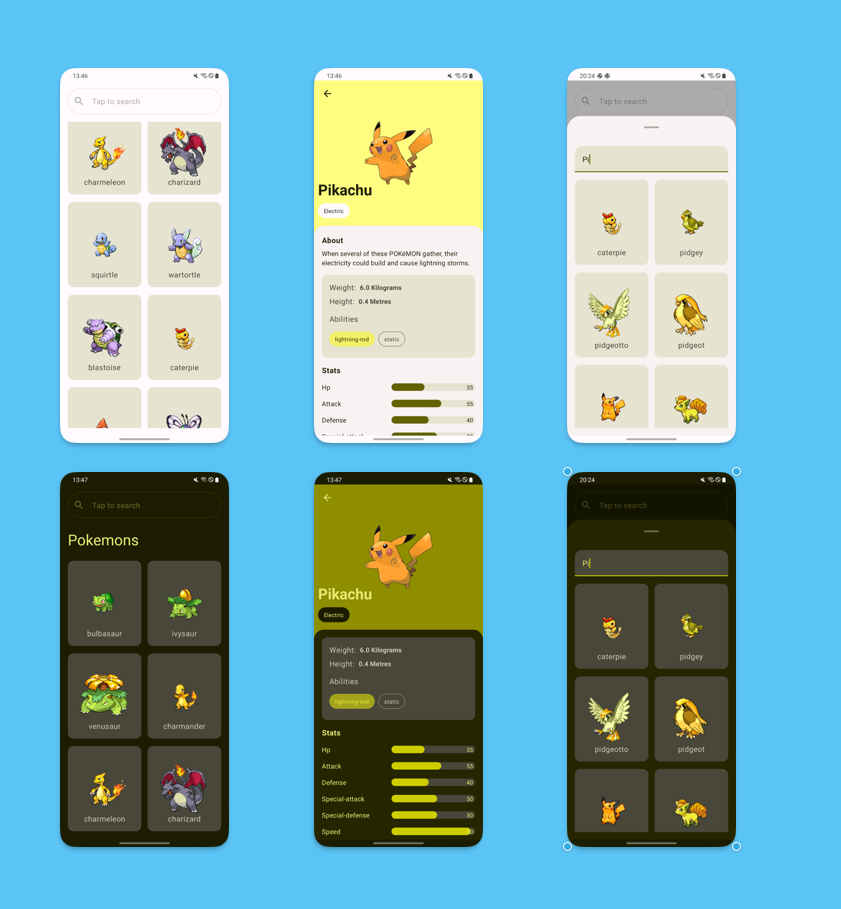

## Pokamon

Pokamon is an  app that uses Pokéapi to display a list of Pokémon species, and their abilities.
## Requirements:

### Home Screen
- A list of the first 100 Pokémon provided by the Pokéapi.
- The picture of the Pokémon on this screen and simple search functionality is optional but recommended

### Info screen

Displayed when a Pokémon is selected from the home screen
Display the following information based on the applicable platforms’ design principles.

- Pokémon Name
- A picture of the selected Pokémon
    - Preferably the front of the pocket monster.
- Any other information that would be relevant, in the API. (e.g. stats)

## Screenshots

## Setup

To setup and run the project, run it
on [Android Studio Giraffe](https://developer.android.com/studio) or a newer Version

## Architecture

The Pokamon app follows architecture as described on
[Guide to app architecture](https://developer.android.com/topic/architecture)
which is comprised of modularization and MVVM.

Below is an abstract diagram of the architecture

### App Module

The app module, depends on all, or relevant `feature modules`. Additionally, the app module can
depend directly on the `core modules`.

### Feature Modules

The feature modules, represent a singular feature of the app, such as pokedex (list of pokemon and the details). It allows us
to decouple the features from the app itself and test these in isolation.

> It is important to note that no feature modules should ever depend on other feature modules.

### Core Modules

The core modules include code that is common amongst features, and other core modules. This includes
things such as the design system.

Features depend on core modules and core modules can depend on one another. We should be careful to
not create cyclical dependencies amongst the core modules, however.

In the case of cyclical dependencies we most likely can refactor the code which is needed into a
separate core module such as `:core-common`

## Libraries and tools

Some of the libraries and tools used in the project include

- [Kotlin](https://developer.android.com/kotlin?gclid=Cj0KCQjwoK2mBhDzARIsADGbjeoMVO2Ww0zuUmtQGg8DUqVSPDWhBPGC8vGmtx1GOrh6ZpfoOFIEbKcaAoH1EALw_wcB&gclsrc=aw.ds)
  as the main language (and for testing)
- [JetPack Compose](https://developer.android.com/jetpack/compose?gclid=Cj0KCQjwoK2mBhDzARIsADGbjepwqpW6sXqc0B5GpGglo6zv7XivC252sRc1vbv5HR9Ao--GzmRNKf4aAqPFEALw_wcB&gclsrc=aw.ds)
  for UI and navigation
- [Accompanist](https://github.com/google/accompanist) : A collection of extension libraries for
  Jetpack Compose
- [Material Icons](https://developer.android.com/jetpack/compose/graphics/images/material)
- [Coil](https://coil-kt.github.io/coil/compose/) - For image loading
- [Hilt](https://developer.android.com/training/dependency-injection/hilt-android) for dependency
  injection
- [Junit](https://developer.android.com/training/testing/local-tests) - For unit testing
- [Turbine](https://github.com/cashapp/turbine) - Turbine is a small testing library for
  kotlinx.coroutines Flow
- [Kotlin Coroutines](https://kotlinlang.org/docs/coroutines-overview.html) for asynchronous and
  reactive programming
- [Retrofit](https://square.github.io/retrofit/) for REST networking
- [Eithernet](https://github.com/slackhq/EitherNet) A pluggable sealed API result type for modeling
  Retrofit responses.
- [Moshi](https://github.com/square/moshi) for JSON serialization and conversion
- [Okhttp](https://square.github.io/okhttp/) for network and logging
- [Instantiatior](https://hannesdorfmann.com/instantiator/) A little tool that uses reflections to instantiate test data
- [build logic convention](https://medium.com/@amsavarthan/unlocking-reusability-in-gradle-how-to-use-kotlin-written-convention-plugins-11b95cb008ef)
  for build management